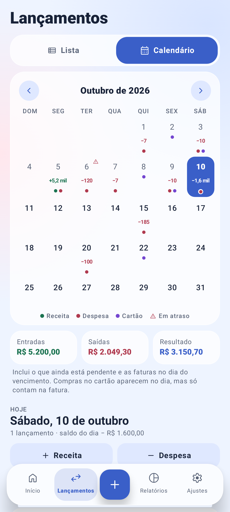

# Calendário de lançamentos

Disponível desde a versão 1.3.0, na aba **Lançamentos › Calendário**.

O calendário mostra o mês em grade, com o que entra e o que sai em cada dia. Ele serve para ver os dias apertados do mês (por exemplo, o aluguel vencendo antes do salário cair) sem ler a lista inteira.

> A imagem é gerada a partir do app real pelo fluxo *Capturas de tela* do GitHub Actions (ou `./gradlew testDebugUnitTest -PfinanScreenshots=true`). Se ela ainda não aparecer, rode esse fluxo uma vez.

## Como usar

1. Abra a aba **Lançamentos** e toque em **Calendário** no alto da tela. Para voltar à lista, toque em **Lista**.
2. Troque de mês pelas setas **‹ ›** ou deslizando o calendário para o lado. Fora do mês atual aparece **Voltar para hoje**.
3. Toque num dia para ver os lançamentos dele logo abaixo do calendário.
4. Na lista do dia:
   - toque num lançamento para editá-lo;
   - toque no círculo para marcar como pago ou recebido, como na lista normal;
   - toque numa fatura para abrir **Pagar fatura**;
   - toque em **Novo** para criar um lançamento já com a data desse dia. Se a data for futura, o lançamento começa como pendente.

A escolha entre Lista e Calendário, o mês e o dia escolhido continuam iguais ao girar a tela e depois do bloqueio automático. Com o app aberto na virada do dia, o calendário acompanha a nova data se estava em "hoje".

## O que cada dia mostra

| Elemento | Significado |
|---|---|
| Número do dia | Em cinza, os dias que já passaram. Hoje tem contorno azul. O dia escolhido fica preenchido. |
| Valor pequeno (+5,2 mil, −120) | Saldo do dia: o que entra menos o que sai das contas nesse dia. Verde quando o saldo é positivo ou zero, vermelho quando é negativo. Fica sem "R$" e é arredondado para caber (veja abaixo). |
| Pontinho verde | Há receita no dia. |
| Pontinho vermelho | Há despesa na conta no dia, paga ou pendente. |
| Pontinho roxo | Há algo de cartão: compra no cartão, pagamento de fatura ou fatura vencendo. |
| Ícone de alerta | Há conta pendente com data passada ou fatura vencida ainda em aberto. |

### Arredondamento do valor do dia

O quadradinho do dia é estreito, então o valor aparece abreviado e arredondado ao mais próximo:

| Valor | Mostra |
|---|---|
| R$ 182,40 | 182 |
| R$ 119,90 | 120 |
| R$ 1.500,00 | 1,5 mil |
| R$ 15.499,00 | 15 mil |
| R$ 1.200.000,00 | 1,2 mi |

O valor exato aparece no resumo do dia, logo abaixo do calendário, e é o que o leitor de tela fala.

## Que lançamentos entram na conta

O calendário mostra **dinheiro entrando e saindo das contas**, o que inclui o que ainda está pendente:

- **Receitas e despesas fora do cartão**, realizadas ou pendentes, na data do lançamento.
- **Pagamentos de fatura**, na data em que foram feitos (o dinheiro sai da conta nesse dia).
- **Faturas em aberto**, no dia do vencimento, com o valor que ainda falta pagar.
- **Compras no cartão** aparecem na lista do dia em que foram feitas, com o pontinho roxo, mas **não entram no saldo do dia**. Esse dinheiro só sai da conta quando a fatura é paga, e já é contado na fatura. Assim nada é contado duas vezes.

Abaixo do calendário ficam os totais do mês: **Entradas**, **Saídas** e **Resultado**. Eles são exatamente a soma dos dias. Por incluir pendências e faturas, podem ser diferentes dos totais da Lista, que somam só o que já foi realizado no período.

No dia escolhido, de hoje em diante, aparece também o **Saldo previsto ao fim do dia**. É a mesma conta do "Saldo previsto" do Início: o saldo atual das contas mais tudo o que está pendente até aquele dia, menos as faturas em aberto que vencem até lá.

O calendário mostra todos os lançamentos do mês. A busca e os filtros de tipo e situação valem só para a Lista.

## Privacidade e acessibilidade

- **Ocultar valores:** com essa opção ligada, os valores somem de dentro dos dias e ficam só os pontinhos. Os totais do mês e os lançamentos do dia aparecem como "R$ ••••", como no resto do app.
- **Leitor de tela (TalkBack):** cada dia é lido como uma frase completa, por exemplo "6 de outubro, terça-feira, 1 lançamento, saldo do dia menos R$ 119,90, em atraso". Com "Ocultar valores", o valor não é falado. O nome do mês é anunciado ao trocar de mês, e as setas têm os nomes "Mês anterior" e "Próximo mês". O cabeçalho dos dias da semana e a legenda são decorativos e não são lidos.
- **Toque:** cada dia tem pelo menos 54dp de altura. As setas e a chave Lista/Calendário têm 48dp.
- **Fonte grande:** o número do dia acompanha o tamanho de fonte do sistema. O valor pequeno cresce até 1,15× e, se ainda não couber, diminui até caber, sem ser cortado com "…".

## Como foi feito

| Arquivo | O quê |
|---|---|
| `core/MonthCalendar.kt` (novo) | Regras do calendário, sem Android: grade do mês começando no domingo, lançamentos e faturas de cada dia, saldo do dia, atrasos, totais, valor abreviado, títulos ("Quinta, 15 de outubro") e o texto do leitor de tela. Não depende do idioma do aparelho. |
| `ui/screens/CalendarView.kt` (novo) | Desenho em Compose: chave Lista/Calendário, grade, legenda, totais, cabeçalho do dia e linha de fatura. Reaproveita `TxRow`, `Glass`, `Pill` e `MoneyText`. |
| `ui/screens/MovesScreen.kt` | Mostra a chave no topo e, no modo Calendário, os itens do calendário no lugar da lista. |
| `ui/Root.kt` | `MovesView` (Lista/Calendário), mês e dia do calendário guardados na navegação (sobrevivem a girar a tela e ao bloqueio). `Sheet.TxEdit` ganhou `date`, a data inicial de um lançamento novo. O calendário acompanha a virada do dia. |
| `ui/screens/Sheets.kt` | O editor usa a data recebida. Data futura começa como pendente. |
| `ui/components/AppIcon.kt` + `res/drawable/ms_*.xml` | Ícones Material Symbols novos: `calendar_month`, `view_list`, `chevron_left` e `chevron_right`. |
| `test/.../core/CalendarTest.kt` (novo) | 7 testes: grade, soma do dia sem compras no cartão, fatura no vencimento, atrasos, totais iguais à soma dos dias, valores abreviados, títulos e texto do leitor de tela. |
| `test/.../screenshots/ScreenshotTest.kt` | Captura `calendario.png` junto das outras telas. |

Os dados e o formato do backup **não mudaram**: o calendário é só uma forma de ver os lançamentos que já existem. Por isso ele pode ser levado ao Finan+ web e ao Finan+ para Linux sem afetar a compatibilidade dos backups.
